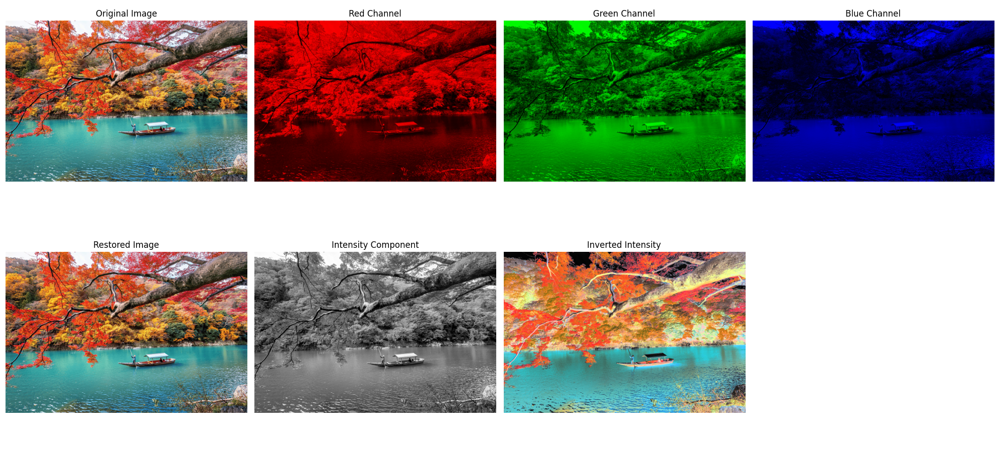
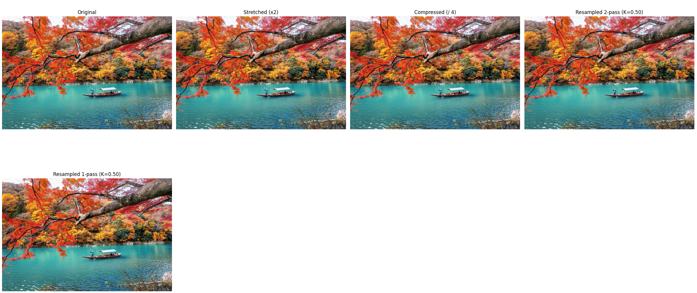
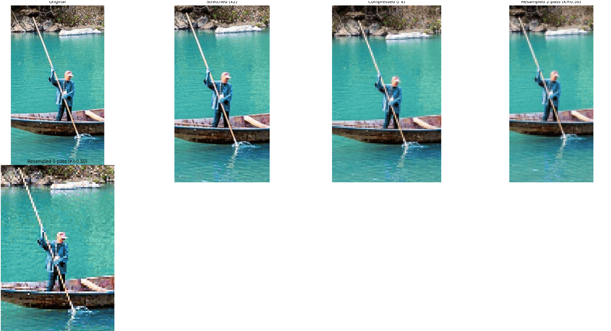

                                                         
# Лабораторная работа №1  
## **Цветовые модели и передискретизация изображений**

**ФИО:** Макиенко Никита Владимирович  
**Группа:** Б22-504  

---

## Цель работы
Изучение цветовых моделей, преобразование изображений между моделями RGB и HSI, работа с компонентами изображений, реализация ручной передискретизации с использованием алгоритмов интерполяции и децимации.

---

## Использованные библиотеки
- `NumPy` — численные вычисления, массивы
- `Matplotlib` — визуализация

---

## Реализованные функции

### 1. **Разделение на компоненты R, G, B**
```python
R = img.copy(); R[:, :, 1:] = 0
G = img.copy(); G[:, :, [0, 2]] = 0
B = img.copy(); B[:, :, :2] = 0
```
Каждый канал сохраняется отдельно для визуализации.

---

### 2. **Обратная сборка изображения из R, G, B**
```python
restored_image = np.stack([R[:, :, 0], G[:, :, 1], B[:, :, 2]], axis=-1)
```
Воссоздаёт исходное изображение из отдельных каналов.

---

### 3. **Преобразование RGB → HSI**
```python
def rgb_to_hsi(image): ...
```
Ручная реализация преобразования по формуле. Возвращает H, S, I компоненты.

---

### 4. **Инверсия яркости (I)**
```python
I_inverted = 1 - I
result_rgb = hsi_to_rgb(H, S, I_inverted)
```
Инвертирует компоненту яркости и преобразует изображение обратно в RGB.

---

### 5. **HSI → RGB**
```python
def hsi_to_rgb(H, S, I): ...
```
Полная ручная реализация обратного преобразования.


---

### 6. **Растяжение изображения (интерполяция)**
```python
def resize_image_linear(img, scale): ...
```
Реализация билинейной интерполяции **без библиотек**.

---

### 7. **Сжатие изображения (децимация с усреднением)**
```python
def downscale_image(img, scale): ...
```
Блоковое усреднение пикселей.

---

### 8. **Передискретизация в два прохода (K = M / N)**
```python
stretched = resize_image_linear(img, M)
resampled_two_pass = downscale_image(stretched, N)
```
Сначала увеличивает, затем сжимает изображение.

---

### 9. **Передискретизация за один проход**
```python
resampled_one_pass = resize_image_linear(img, K)
```
Прямое изменение масштаба с коэффициентом \( K \).

---


---
## Визуализация
| Этап | Изображение |
|------|-------------|
| Исходное изображение | `ph5.png` |
| Красный, зелёный, синий каналы | `R_channel.png`, `G_channel.png`, `B_channel.png` |
| Восстановленное RGB | `restored_image.png` |
| Компонента яркости I | `I_component.png` |
| Инверсия яркости | `inverted_intensity.png` |
| Растяжение | `stretched_image.png` |
| Сжатие | `compressed_image.png` |
| Передискретизация в два прохода | `resampled_two_pass.png` |
| Передискретизация за один проход | `resampled_one_pass.png` |

---


