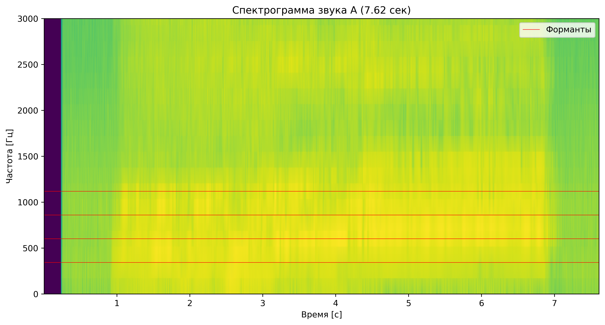
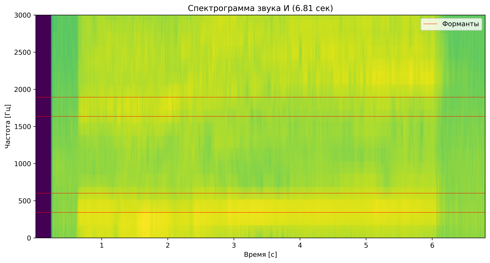
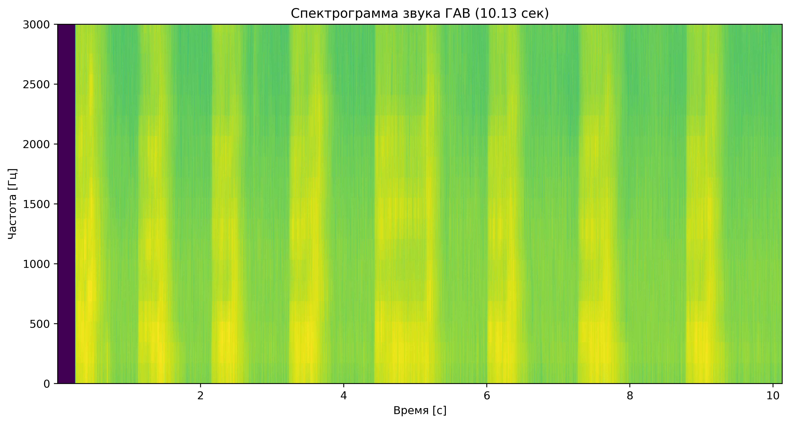

# Лабораторная работа №10. Обработка голоса  
**ФИО:** Макиенко Никита Владимирович  
**Группа:** Б22-504  

---

Лабораторная работа выполнялась для записи звуков "А" и "И" мужским голосом, а также для имитации собачьего лая.  
Построены спектрограммы записи названных звуков и приведен их анализ:  
- Определение длительности, частоты дискретизации и количества семплов  
- Поиск частоты с максимальной амплитудой  
- Выявление формантных областей  

## Спектрограмма записи звука "А"  
  

### Анализ  
**Длительность:** 7.62 сек  
**Частота дискретизации:** 44100 Гц  
**Количество семплов:** 335865  
**Максимальная частота (с максимальной амплитудой):** 689.06 Гц  
**Форманты:** 344 Гц (FI), 602 Гц (FII), 861 Гц (FIII), 1119 Гц (FIV)  

## Спектрограмма записи звука "И"  
  

### Анализ  
**Длительность:** 6.81 сек  
**Частота дискретизации:** 44100 Гц  
**Количество семплов:** 300116  
**Максимальная частота (с максимальной амплитудой):** 172.27 Гц  
**Форманты:** 344 Гц (FI), 602 Гц (FII), 1636 Гц (FIII), 1894 Гц (FIV)  

## Спектрограмма записи лая  
  

### Анализ  
**Длительность:** 10.13 сек  
**Частота дискретизации:** 44100 Гц  
**Количество семплов:** 446880  
**Максимальная частота (с максимальной амплитудой):** 344.53 Гц  
**Форманты:** не обнаружены  

## Выводы  

1. **Сравнение звуков "А" и "И":**  
   - Оба звука имеют схожие первые две форманты (344 Гц и 602 Гц), что характерно для гласных, произносимых мужским голосом.  
   - Звук "И" демонстрирует более высокие частоты третьей и четвертой формант (1636 Гц и 1894 Гц), что связано с его артикуляционными особенностями.  
   - Максимальная амплитуда у звука "А" приходится на более высокую частоту (689.06 Гц), чем у звука "И" (172.27 Гц).  

2. **Анализ имитации лая:**  
   - В отличие от гласных звуков, запись лая не имеет выраженных формант.  
   - Максимальная энергия сосредоточена на частоте 344.53 Гц, что может соответствовать основному тону имитированного лая.  

Таким образом, спектральный анализ позволяет четко различить особенности разных звуков, включая гласные речи и неречевые звуковые сигналы.