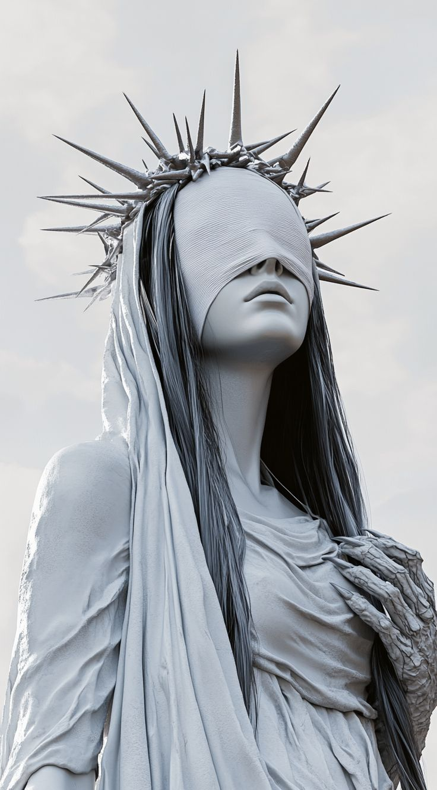
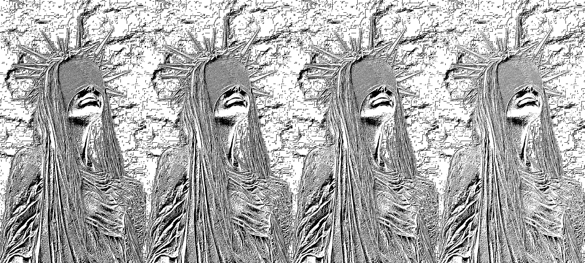
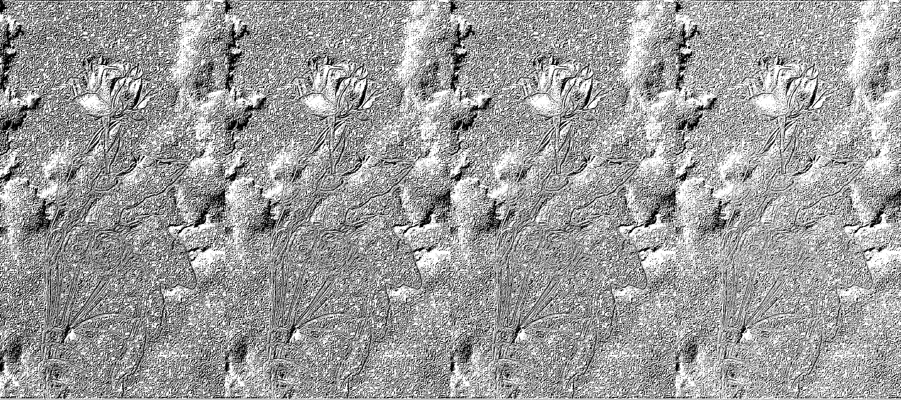
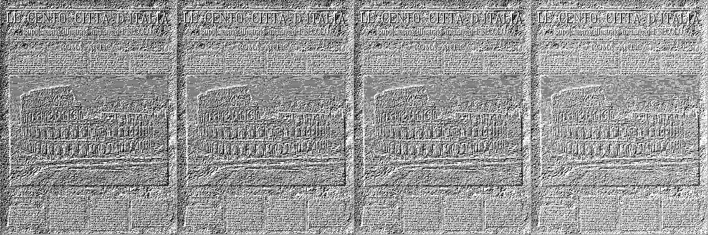
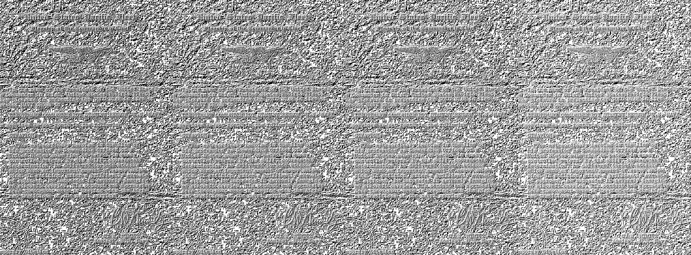

# Лабораторная работа №2  
## **Обесцвечивание и бинаризация растровых изображений**

**ФИО:** Макиенко Никита Владимирович  
**Группа:** Б22-504  
**Вариант 6:** Адаптивная бинаризация Ниблэка
---

## Цель работы
Изучение методов перевода цветных изображений в полутоновые, а также реализация адаптивной бинаризации методом Ниблэка с использованием окна 3×3 и сравнение результатов при различных параметрах.

---

## Использованные библиотеки
- `Pillow` — чтение, преобразование и сохранение изображений
- `NumPy` — численные вычисления, массивы

---

## Реализованные функции и действия

### 1. **Обесцвечивание изображения вручную (RGB → Grayscale)**
```python
gray_pixels = (0.299 * pixels[:, :, 0] +
               0.587 * pixels[:, :, 1] +
               0.114 * pixels[:, :, 2]).astype(np.uint8)
```
Вычисление яркости каждого пикселя по взвешенной формуле и формирование одноканального изображения.

---

### 2. **Расчёт локальных статистик (среднее и стандартное отклонение)**
```python
def compute_local_stats(image, window):
    h, w = image.shape
    mean = np.zeros((h, w))
    std = np.zeros((h, w))
    for i in range(h):
        for j in range(w):
            region = image[i:i+window, j:j+window]
            mean[i, j] = np.mean(region)
            std[i, j] = np.std(region)
    return mean, std
```
Функция для ручного расчёта локальных статистик яркости в окне заданного размера (в работе — 3×3).

---

### 3. **Адаптивная бинаризация методом Ниблэка**
```python
threshold = mean + k * std
binary = (gray >= threshold).astype(np.uint8) * 255
```
Для каждого пикселя рассчитывается локальный порог по формуле метода Ниблэка:

\[
T(x, y) = m(x, y) + k \cdot s(x, y)
\]

Пороговое значение сравнивается с яркостью исходного изображения для получения бинарного результата.

---

### 4. **Эксперименты с параметром `k`**
```python
k_values = [-0.1, -0.2, -0.3, -0.5]
for k in k_values:
    threshold = mean + k * std
    ...
```
Проводится тестирование бинаризации при различных значениях параметра `k`, влияющего на чувствительность порогов. Все результаты сохраняются в отдельные изображения.

---

### 5. **Создание коллажа из бинарных изображений**
```python
collage = np.hstack(images)
collage_image = Image.fromarray(collage.astype(np.uint8))
collage_image.save('collage_niblack_k_values.bmp')
```
Объединение полученных изображений для наглядного сравнения в один файл.

---

## Визуализация


---




---



---



---



---
| Этап | Изображение |
|------|-------------|
| Полутоновое изображение | `ph1_gray.bmp` |
| Бинаризация (k = -0.1) | `niblack_k_-0.1.bmp` |
| Бинаризация (k = -0.2) | `niblack_k_-0.2.bmp` |
| Бинаризация (k = -0.3) | `niblack_k_-0.3.bmp` |
| Бинаризация (k = -0.5) | `niblack_k_-0.5.bmp` |
| Сравнительный коллаж | `collage_niblack_k_values.bmp` |

---

## Вывод
В ходе лабораторной работы была вручную реализована процедура перевода цветного изображения в полутоновое, а также метод адаптивной бинаризации Ниблэка. Проведено сравнение результатов при различных значениях коэффициента `k`. Метод оказался неэффективным при малом размере окна (3×3), однако работа выполнена в полном соответствии с требованиями задания.
