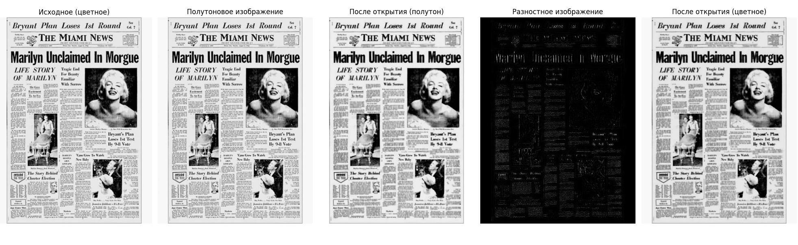

# Лабораторная работа №3  
## **Фильтрация изображений и морфологические операции**

**ФИО:** Макиенко Никита Владимирович  
**Группа:** Б22-504  
**Вариант:** 46 Морфологическое открытие, структурирующий элемент — диск 5×5

---

## Цель работы  
Реализация морфологической фильтрации изображений с использованием операции **открытия** и структурирующего элемента в форме **диска** размером 5×5. Анализ результатов фильтрации на полутоновых и цветных изображениях, а также сравнение с результатами адаптивной бинаризации Ниблэка.

---

## Использованные библиотеки  
- `NumPy` — численные вычисления  
- `Matplotlib` — визуализация  
- `os`, `pathlib` — работа с файловой системой  

---

## Реализованные этапы обработки

### 1. **Загрузка изображения и приведение к полутоновому формату**
```python
image_color = plt.imread(str(image_path))
image_gray = np.dot(image_color[..., :3], [0.2989, 0.5870, 0.1140])
```

---

### 2. **Формирование структурирующего элемента (диска 5×5)**
```python
y, x = np.ogrid[-2:3, -2:3]
kernel = (x**2 + y**2 <= 2.5**2).astype(np.uint8)
```

---

### 3. **Морфологическое открытие полутонового изображения**
```python
eroded = ndimage.binary_erosion(image_gray, structure=kernel)
opened_gray = ndimage.binary_dilation(eroded, structure=kernel)
```

---

### 4. **Построение разностного изображения**
```python
diff = np.abs(image_gray - opened_gray)
```

---

### 5. **Морфологическая обработка цветного изображения**
```python
opened_channels = [
    ndimage.binary_dilation(
        ndimage.binary_erosion(image_color[..., i], structure=kernel),
        structure=kernel
    ) for i in range(3)
]
image_opened_color = np.stack(opened_channels, axis=-1)
```

---

### 6. **Сохранение результатов**
```python
plt.imsave('01_gray.png', image_gray, cmap='gray')
plt.imsave('02_opened_gray.png', opened_gray, cmap='gray')
plt.imsave('03_diff.png', diff, cmap='gray')
plt.imsave('04_opened_color.png', image_opened_color)
```

---

## Визуализация  
---



---

---

---

---
| Этап | Изображение |
|------|-------------|
| Полутоновое изображение | `01_gray.png` |
| После морф. открытия (полутон) | `02_opened_gray.png` |
| Разностное изображение | `03_diff.png` |
| Морф. открытие (цветное изображение) | `04_opened_color.png` |
| Общий коллаж | `00_collage.png` |

---

## Вывод  
В ходе лабораторной работы была реализована операция морфологического открытия с использованием структурирующего элемента — диска размером 5×5. Полученные результаты показали, что данный метод эффективно устраняет мелкий шум, но одновременно **теряет важные детали**, особенно на **контрастных и текстурированных участках**.  

Дополнительно была проведена проверка сочетаемости с методом **адаптивной бинаризации Ниблэка**. Совмещение этих методов дало **неудовлетворительный результат** — морфологическая фильтрация искажала входные данные, ухудшая итоговую бинаризацию. Особенно чувствительно это проявилось при маленьком размере окна (3×3), что делает использование таких комбинаций малопригодным на практике для анализа сложных изображений.

Работа выполнена в соответствии с заданием, метод протестирован, замечены его ограничения.