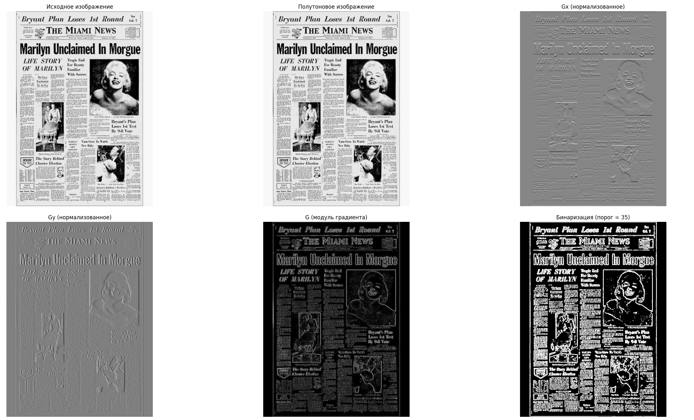
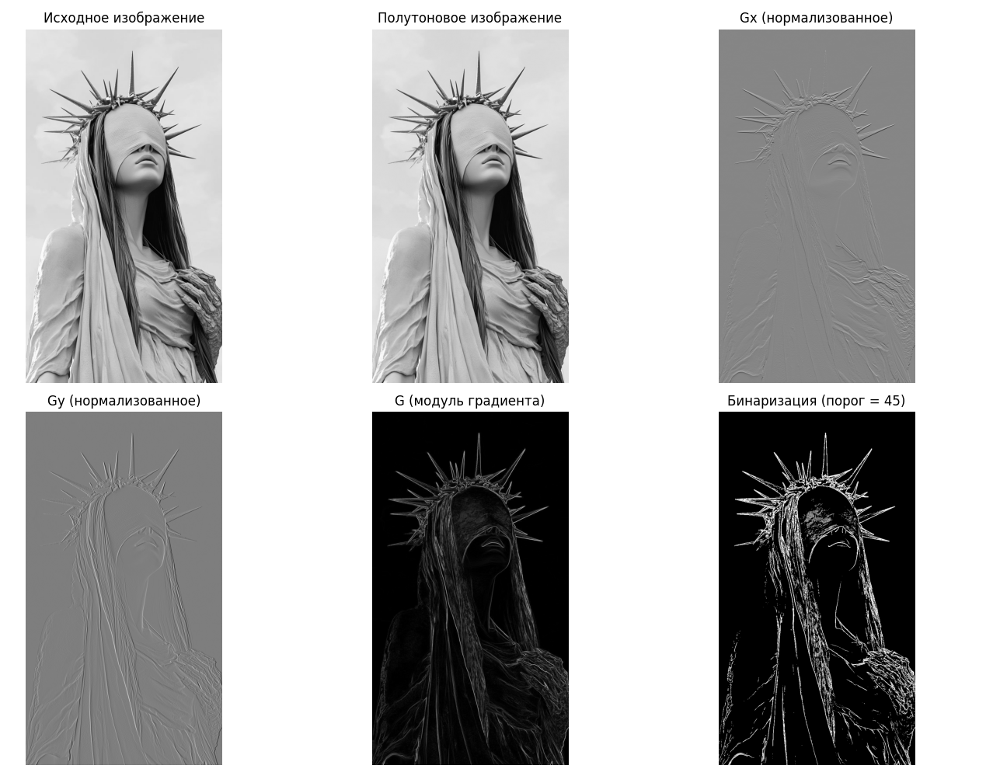
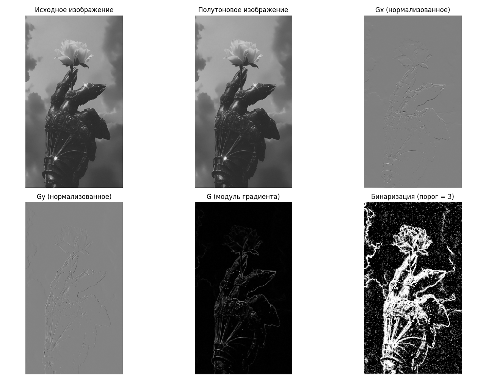
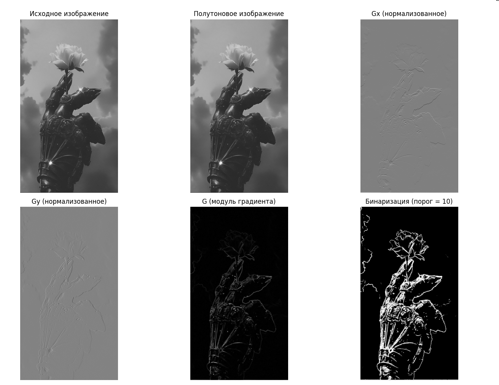
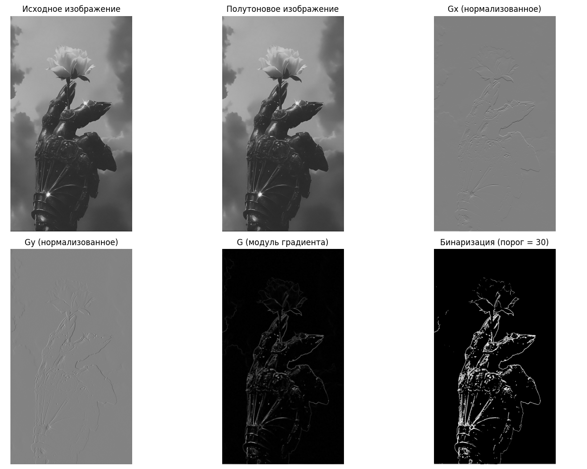

# Лабораторная работа №4  
## **Выделение контуров на изображении**

**ФИО:** Макиенко Никита Владимирович  
**Группа:** Б22-504  
**Вариант:** 46 — Оператор Круна 3×3  

---

## Цель работы  
Реализация оператора Круна (Kroon edge detector) для выделения контуров на полутоновом изображении, анализ градиентов по направлениям `Gx` и `Gy`, построение модуля градиента и бинаризация результата по порогу. Визуальное сравнение всех этапов обработки.

---

## Использованные библиотеки  
- `NumPy` — численные вычисления  
- `Pillow` — загрузка и преобразование изображений  
- `Matplotlib` — визуализация результатов  

---

## Реализованные этапы обработки

### 1. **Загрузка изображения и преобразование в полутоновое**
```python
image_color = Image.open(image_path).convert('RGB')
image_gray = image_color.convert('L')
image_gray_np = np.array(image_gray)
```

---

### 2. **Определение ядер оператора Круна**
```python
Gx = np.array([[17, 61, 17],
               [0,  0,  0],
               [-17, -61, -17]], dtype=np.float32)

Gy = np.array([[17,  0, -17],
               [61,  0, -61],
               [17,  0, -17]], dtype=np.float32)
```

---

### 3. **Применение фильтров к изображению (свертка)**
```python
def apply_filter(image, kernel):
    height, width = image.shape
    k_size = kernel.shape[0]
    pad = k_size // 2
    output = np.zeros_like(image)
    
    padded = np.pad(image, pad, mode='constant')
    
    for y in range(height):
        for x in range(width):
            output[y, x] = np.sum(padded[y:y+k_size, x:x+k_size] * kernel)
    
    return output

grad_x = apply_filter(image_gray_np.astype(np.float32), Gx)
grad_y = apply_filter(image_gray_np.astype(np.float32), Gy)
grad_magnitude = np.sqrt(grad_x**2 + grad_y**2)
```

---

### 4. **Нормализация градиентов**
```python
def normalize(img):
    img_min = np.min(img)
    img_max = np.max(img)
    return ((img - img_min) * (255.0 / (img_max - img_min))).astype(np.uint8)

grad_x_norm = normalize(grad_x)
grad_y_norm = normalize(grad_y)
grad_magnitude_norm = normalize(grad_magnitude)
```

---

### 5. **Бинаризация по модулю градиента**
```python
threshold = 60  # Порог подобран вручную
binary_grad = (grad_magnitude_norm > threshold).astype(np.uint8) * 255
```

---

### 6. **Отображение результатов**
```python
plt.figure(figsize=(15, 10))
plt.subplot(231); plt.imshow(image_gray_np, cmap='gray'); plt.title('Исходное')
plt.subplot(232); plt.imshow(grad_x_norm, cmap='gray'); plt.title('Gx')
plt.subplot(233); plt.imshow(grad_y_norm, cmap='gray'); plt.title('Gy')
plt.subplot(234); plt.imshow(grad_magnitude_norm, cmap='gray'); plt.title('Модуль градиента')
plt.subplot(235); plt.imshow(binary_grad, cmap='gray'); plt.title('Бинаризация')
plt.tight_layout()
plt.show()
```

---

## Визуализация  
  
  
  
  
  

---

## Вывод  
В рамках лабораторной работы был реализован оператор Круна для выделения границ на изображении. Сначала рассчитывались градиенты по горизонтали (`Gx`) и вертикали (`Gy`) с помощью ручной свертки, затем вычислялся модуль градиента и проводилась его нормализация. После этого проводилась бинаризация изображения на основе выбранного порога.  

Эксперименты показали, что оператор Круна хорошо выделяет **ярко выраженные границы**, особенно на контрастных участках изображения. Однако результат чувствителен к выбору порога при бинаризации: слишком высокий порог может «погасить» слабые границы, а слишком низкий — привести к шуму.  

Основные особенности реализации:
- Полностью самостоятельная реализация свертки без использования OpenCV
- Ручная нормализация данных
- Визуализация всех промежуточных результатов

Метод эффективен для изображений с чёткими переходами, но требует **ручной настройки параметров** для различных типов изображений. Работа выполнена в соответствии с заданием, оператор протестирован, выявлены его особенности и ограничения.