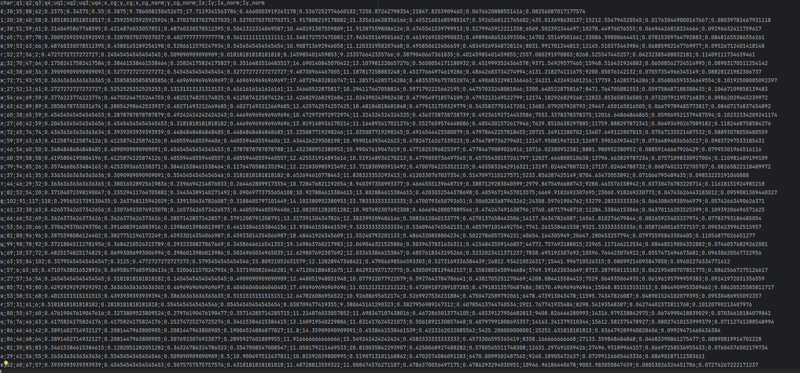

# Лабораторная работа №5
## Выделение признаков символов

**Студент:** Макиенко Никита Владимирович  
**Группа:** Б22-504

---

## Цель работы

Научиться выделять и анализировать признаки символов на основе их изображений: масса, центр тяжести, моменты инерции и профили по координатным осям.

## Вариант 15: Казахские строчные буквы

Алфавит:  
а, ә, б, в, г, ғ, д, е, ё, ж, з, и, й, к, қ, л, м, н, ң, о, ө, п, р, с, т, у, ұ, ү, ф, х, һ, ц, ч, ш, щ, ъ, ы, і, ь, э, ю, я

---

## Этапы выполнения

### 1. Генерация эталонных изображений

- Использован шрифт: `Times New Roman`, кегль `52`.
- Для каждой буквы сгенерировано отдельное PNG-изображение.
- Белые поля были автоматически обрезаны.
- Все изображения сохранены в папку `letters/`.

Пример изображения символа:

                      
---
---

### 2. Вычисление признаков

Для каждого изображения рассчитаны признаки:

- Масса чёрного (вес) по четвертям изображения
- Удельный вес (масса, делённая на площадь четверти)
- Координаты центра тяжести
- Нормированные координаты центра тяжести
- Осевые моменты инерции (по X и Y)
- Нормированные моменты инерции
- Профили по X и Y (гистограммы плотности чёрного цвета)

---

### 3. Сохранение результатов

- Скалярные признаки сохранены в файл `features.csv`, формат CSV (разделитель `;`).
- Профили сохранены в виде PNG-графиков в папку `profiles/`.

Пример графиков профиля:

**X-профиль:**

**Y-профиль:**

---

---
## Выводы

В рамках лабораторной работы были успешно реализованы алгоритмы генерации эталонных изображений символов и выделения признаков. Полученные численные и визуальные данные могут использоваться для классификации, распознавания и анализа символов в последующих исследованиях.

---

## Приложения

- `letters/` — изображения всех символов
- `features.csv` — таблица признаков
- `profiles/` — профили символов
