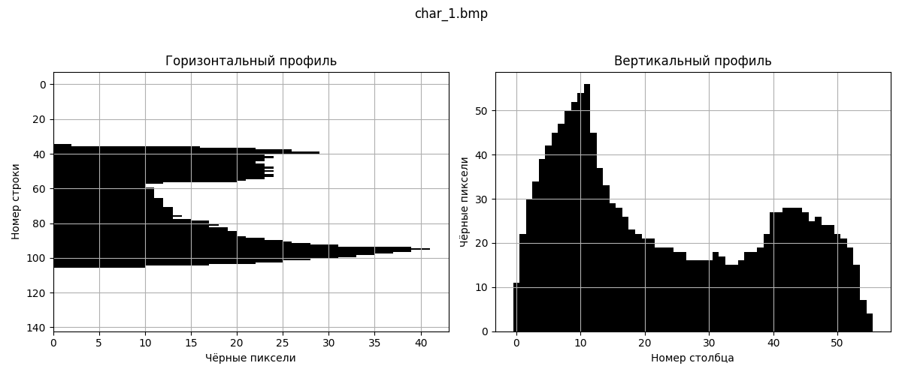
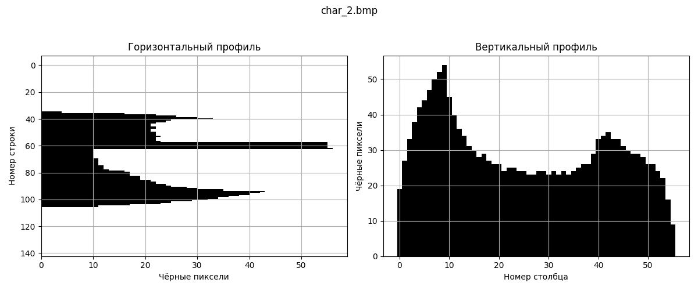
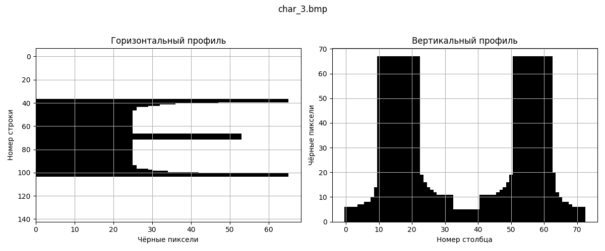

# Лабораторная работа №6  
## Сегментация текста

**Студент:** Макиенко Никита Владимирович  
**Группа:** Б22-504  

---

## Цель работы

Изучить и реализовать методы сегментации текста на символы на основе анализа горизонтальных и вертикальных проекций бинарного изображения.

---

## Этапы выполнения

### 1. Предобработка изображения

- Исходное изображение с романтической фразой было сохранено как `start_img.png`.
- Реализован скрипт `to_cut_mono.py`:
  - Выполняется преобразование в оттенки серого.
  - С помощью инверсии изображения определяется ограничивающий прямоугольник (bbox).
  - Выполняется обрезка по bbox и бинаризация изображения (порог 128).
- Полученное бинарное изображение сохранено как `cropped_mono.bmp` в папку `original/`.
- Горизонтальный профиль:  
---
***Исходное изображение***
  
---
***Обрезанное&монохром***
  
---

### 2. Построение профилей

- Горизонтальный и вертикальный профили построены с помощью скрипта `make_ph_profiles.py`.
- Профили отображают количество чёрных пикселей по строкам (горизонтальный) и столбцам (вертикальный).
- Графики сохранены в папку `orig_mono_prophile/`.

**Примеры профилей:**

- Горизонтальный&Вертикальные профили:  
  ,
,

---

### 3. Сегментация символов

- Реализован скрипт `letter's_profiles.py`, который:
  - Анализирует вертикальный профиль.
  - Находит границы символов по заданному порогу (по количеству чёрных пикселей в столбце).
  - Позволяет избежать слияния символов (например, `ү` и `р`), устанавливая параметр `profile_threshold` равным `3`.
  - Разделяет изображение на отдельные символы и сохраняет их в папку `segmented_letters/`.

**Пример результата:**

Символы вырезаны по границам и сохранены как отдельные `.bmp` файлы:  

---

## Выводы

В ходе лабораторной работы реализованы основные этапы сегментации текста:
- Предобработка и бинаризация изображения.
- Построение горизонтального и вертикального профилей.
- Разделение текста на отдельные символы на основе анализа вертикального профиля.

Подобный подход может быть использован в системах распознавания рукописного и печатного текста, а также в предварительной обработке данных для машинного обучения.

---

## Приложения

- `original/start_img.png` — исходное изображение
- `original/cropped_mono.bmp` — бинаризованное изображение
- `orig_mono_prophile/` — графики горизонтального и вертикального профилей
- `segmented_letters/` — изображения сегментированных символов
- Скрипты:
  - `to_cut_mono.py`
  - `make_ph_profiles.py`
  - `letter's_profiles.py`