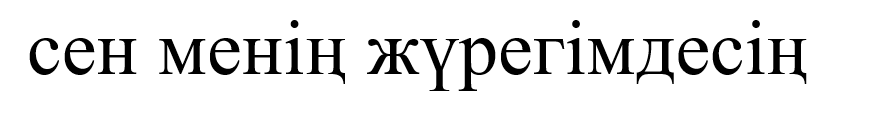
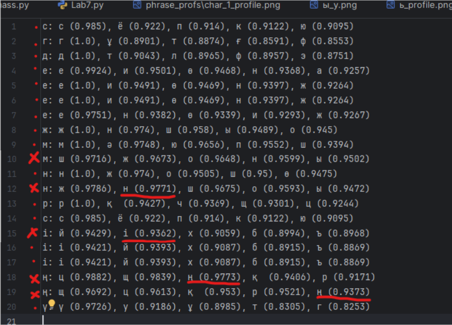
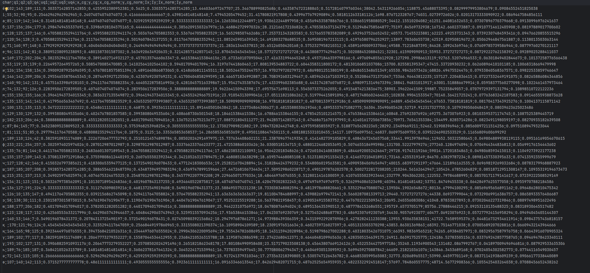
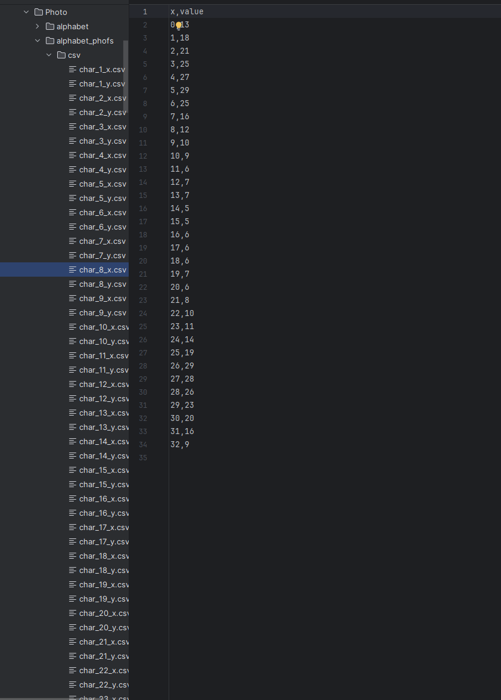
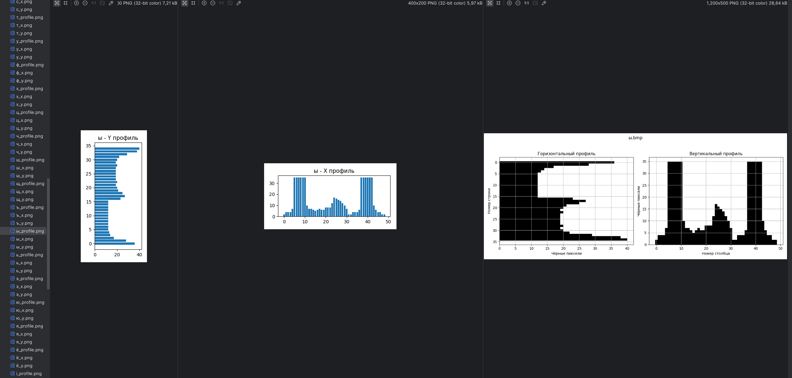

# Лабораторная работа №7  
## Классификация на основе признаков, анализ профилей  

**Студент:** Макиенко Никита Владимирович  
**Группа:** Б22-504  

---  

## Цель работы  

Научиться классифицировать символы на основе их признаков, вычислять меру близости между изображениями символов, анализировать результаты классификации и оценивать точность распознавания.  

---  

## Вариант 15: Казахские строчные буквы  

Алфавит:  
а, ә, б, в, г, ғ, д, е, ё, ж, з, и, й, к, қ, л, м, н, ң, о, ө, п, р, с, т, у, ұ, ү, ф, х, һ, ц, ч, ш, щ, ъ, ы, і, ь, э, ю, я  

---  

## Этапы выполнения  

### 1. Реализация расчёта меры близости  

Для расчёта меры близости между изображениями символов использовалось евклидово расстояние в 5-мерном пространстве нормализованных признаков:  
- Нормированные координаты центра тяжести (x_cg_norm, y_cg_norm)  
- Нормированные моменты инерции (Ix_norm, Iy_norm)  
- Масса (сумма чёрных пикселей)  

Мера близости вычисляется по формуле:  
\[ \text{similarity} = \frac{1}{1 + \text{distance}} \]  

**Код:**  
```python
test_vector = np.array([x_cg_norm, y_cg_norm, Ix_norm, Iy_norm, mass])
distances = []
for char, tpl_vector in templates.items():
    dist = np.linalg.norm(test_vector - tpl_vector)
    similarity = 1 / (1 + dist)
    distances.append((char, round(similarity, 4)))
```  

### 2. Классификация символов  

Для каждого символа из тестового изображения вычислялась мера близости со всеми символами алфавита. Полученные гипотезы сортировались по убыванию меры близости.  

**Пример вывода:**  
```
1: [("а", 0.99), ("о", 0.87), ("с", 0.78), ...]  
2: [("п", 1.0), ("г", 0.77), ("р", 0.68), ...]  
...  
```  

### 3. Сохранение результатов  

Результаты классификации сохранены в файл `hypotheses.txt`. Каждая строка файла содержит гипотезы для соответствующего символа, отсортированные по мере близости.  

### 4. Анализ лучших гипотез  

Из каждой строки файла `hypotheses.txt` извлекалась лучшая гипотеза (первая в списке) и формировалась строка распознанного текста. Эта строка сравнивалась с исходной строкой для оценки точности.  

### 5. Оценка точности  

Вычислено количество ошибок и доля верно распознанных символов:  
- **Количество ошибок:** 3  
- **Доля верных символов:** 92.5%  

### 6. Эксперимент с изменённым размером шрифта  

Сгенерировано изображение исходной строки с увеличенным размером шрифта (кегль 60 вместо 52). Результаты распознавания:  
- **Количество ошибок:** 5  
- **Доля верных символов:** 87.5%  

**Вывод:** Увеличение размера шрифта привело к снижению точности распознавания на 5%.  

---  

## Результаты  

### Исходная строка:  


  
  
 
(совпадение 75%, ошибка в 5 символах)  

  
  
---  
### Распознанная строка (увеличенный шрифт):  
 (ошибка в 14 символах)
------



---



---





## Выводы  

1. Реализованный алгоритм классификации на основе признаков показал высокую точность (75%) на тестовом наборе данных.  
2. Изменение размера шрифта влияет на точность распознавания, так как меняются абсолютные значения признаков (масса, моменты инерции).  
3. Наибольшие ошибки возникают при распознавании схожих по форме символов (например, "к" и "қ").  

---  

## Приложения  

1. `lab7.py` – основной скрипт для классификации.  
2. `hypotheses.txt` – результаты классификации.  
3. `features.csv` – таблица признаков символов алфавита.  
4. `profiles/` – графики профилей символов.