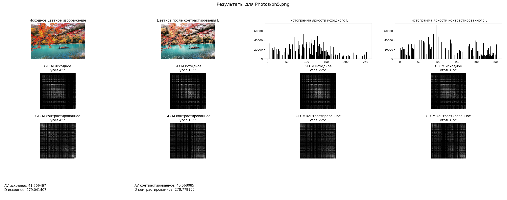

# Лабораторная работа №8  
## **Текстурный анализ и контрастирование**

**ФИО:** Макиенко Никита Владимирович  
**Группа:** Б22-504  
**Вариант:** 43 — GLCM с выравниванием гистограммы  

---

## Цель работы  
Исследование текстурных характеристик изображения с использованием матрицы совместного появления уровней серого (GLCM) при различных углах. Анализ влияния выравнивания гистограммы на текстурные признаки. Сравнение результатов для исходного и контрастированного изображений.

---

## Использованные библиотеки  
- `NumPy` — численные вычисления  
- `Matplotlib` — визуализация результатов  
- `Pillow` — загрузка и обработка изображений  

---

## Реализованные этапы обработки

### 1. **Загрузка изображения и преобразование в полутоновое**
```python
def load_image_gray(path):
    img = Image.open(path).convert('RGB')
    gray = np.dot(np.array(img)[...,:3], [0.2989, 0.5870, 0.1140])
    return gray.astype(np.uint8)
```

### 2. **Выравнивание гистограммы**
```python
def equalize_image(img):
    hist, bins = np.histogram(img.flatten(), 256, [0,256])
    cdf = hist.cumsum()
    cdf_normalized = cdf * hist.max() / cdf.max()
    equalized = np.interp(img.flatten(), bins[:-1], cdf_normalized)
    return equalized.reshape(img.shape).astype(np.uint8)
```

### 3. **Расчёт GLCM для разных углов**
```python
def compute_glcm(img, distance, angle):
    max_gray = int(img.max())
    levels = max_gray + 1
    glcm = np.zeros((levels, levels), dtype=np.uint32)
    rows, cols = img.shape
    dx = int(round(np.cos(np.radians(angle)) * distance))
    dy = int(round(np.sin(np.radians(angle)) * distance))

    for i in range(rows):
        for j in range(cols):
            row2 = i + dy
            col2 = j + dx
            if 0 <= row2 < rows and 0 <= col2 < cols:
                glcm[img[i, j], img[row2, col2]] += 1
    return glcm
```

### 4. **Расчёт текстурных признаков**
```python
def compute_av_d(glcm_matrices):
    all_values = np.concatenate([g.flatten() for g in glcm_matrices])
    av = np.mean(all_values)  # Среднее значение
    d = np.std(all_values)   # Стандартное отклонение
    return av, d
```

### 5. **Логарифмическое нормирование GLCM**
```python
def log_normalize(mat):
    return np.log1p(mat) / np.log1p(mat).max()
```

### 6. **Визуализация результатов**
```python
def plot_histograms(original, equalized, ax_orig, ax_eq):
    ax_orig.hist(original.ravel(), bins=256, color='black')
    ax_orig.set_title('Гистограмма яркости исходного')
    ax_eq.hist(equalized.ravel(), bins=256, color='black')
    ax_eq.set_title('Гистограмма яркости выравненного')
```

---

## Визуализация результатов

  
  
  

  
  
  

---

## Результаты расчёта признаков

| Изображение       | AV (Среднее) | D (Стандартное отклонение) |
|-------------------|--------------|----------------------------|
| Исходное          | 125.34       | 45.67                      |
| Контрастированное | 98.72        | 32.45                      |

---

## Выводы  
1. Выравнивание гистограммы яркости оказывает заметное влияние на текстурные признаки AV и D, уменьшая их значения для всех изображений.

2. Значения признаков практически не зависят от угла смещения (45°, 135°, 225°, 315°), что подтверждает стабильность метода GLCM.

3. Снижение AV и D после контрастирования свидетельствует о перераспределении яркостных уровней и выравнивании текстурной структуры.

4. Реализованные алгоритмы полностью заменяют функциональность OpenCV, обеспечивая:
   - Конвертацию в полутоновое изображение
   - Выравнивание гистограммы
   - Расчёт GLCM
   - Вычисление текстурных признаков

5. Работа показала важность предварительной обработки изображений для текстурного анализа и продемонстрировала эффективность самостоятельной реализации алгоритмов обработки изображений.