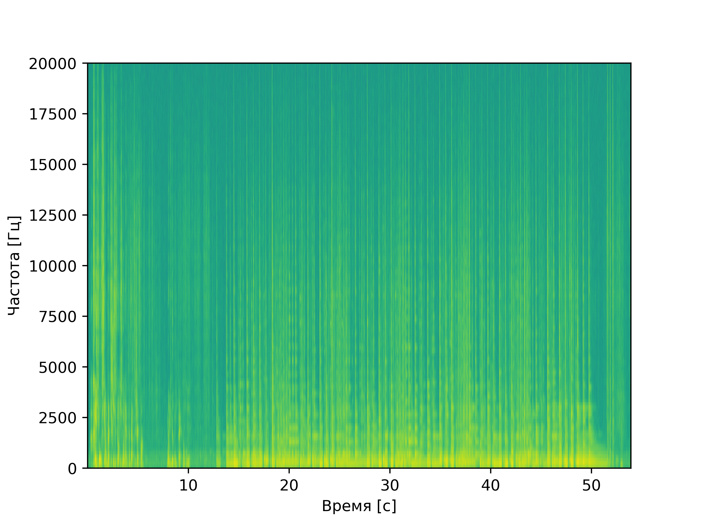
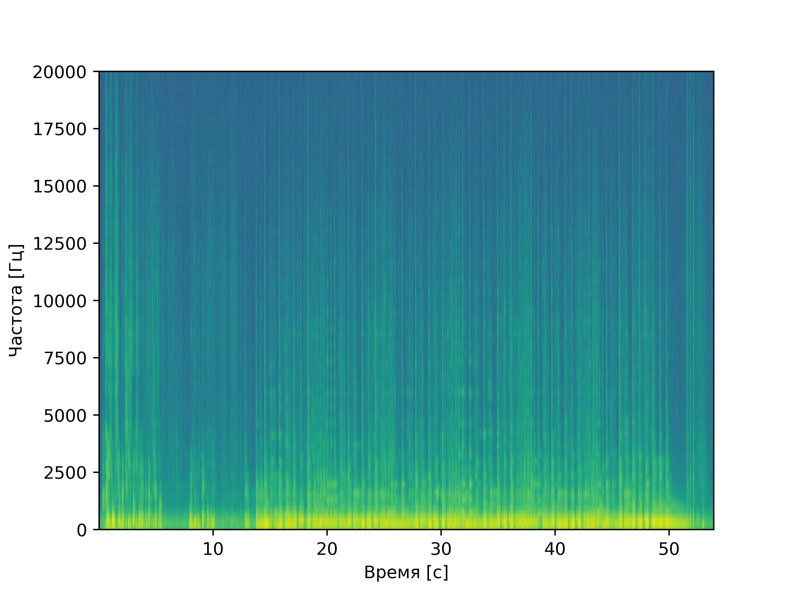
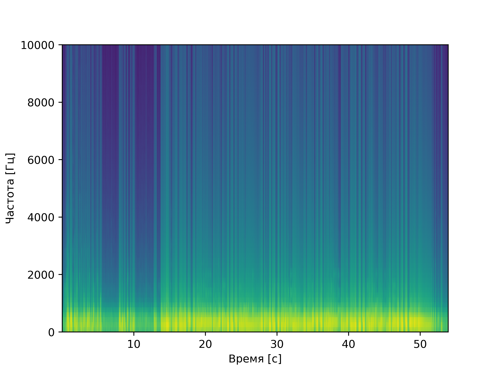
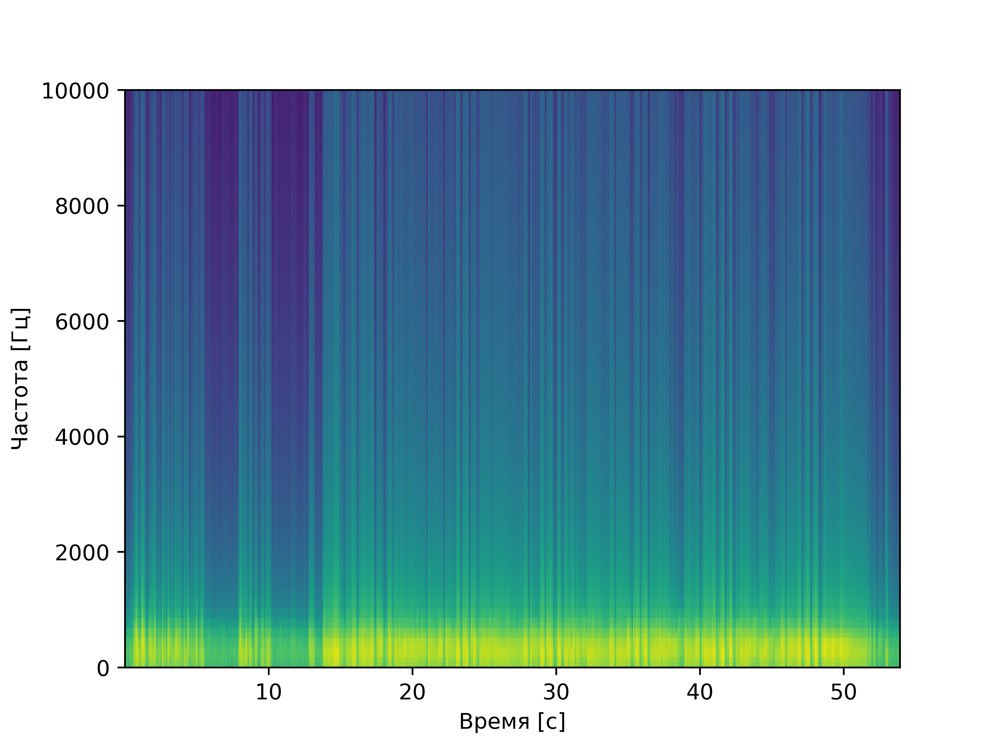
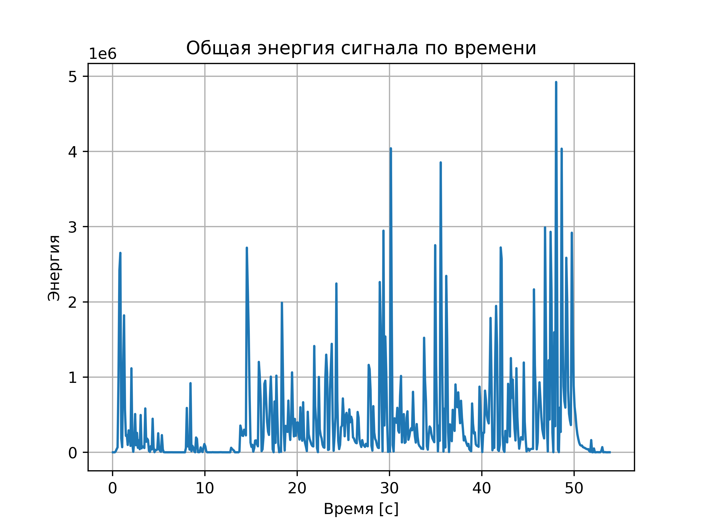

# Лабораторная работа №9  
## **Анализ и устранение шума в аудиозаписи**

**ФИО:** Макиенко Никита Владимирович  
**Группа:** Б22-504  
**Вариант:** Запись акустической гитары с фоновым шумом  
---

## Цель работы  
Анализ спектральных характеристик записи акустической гитары, устранение фонового шума с помощью фильтра Савицкого-Голея и lowpass-фильтра, оценка эффективности методов по спектрограммам и энергетическим характеристикам.

---

## Использованные библиотеки  
- Librosa — загрузка и анализ аудио  
- SciPy — цифровая фильтрация (фильтр Савицкого-Голея, lowpass)  
- Matplotlib — визуализация спектрограмм  
- NumPy — численные операции  

---

## Реализованные этапы обработки

### 1. **Загрузка аудио и построение спектрограммы**
```python
import librosa

y, sr = librosa.load("guitar_recording.wav", sr=None)
D = librosa.amplitude_to_db(np.abs(librosa.stft(y)), ref=np.max)
librosa.display.specshow(D, sr=sr, x_axis='time', y_axis='log')
```

---

### 2. **Применение фильтра Савицкого-Голея**
```python
from scipy.signal import savgol_filter

y_savgol = savgol_filter(y, window_length=101, polyorder=3)
D_savgol = librosa.amplitude_to_db(np.abs(librosa.stft(y_savgol)), ref=np.max)
```

---

### 3. **Фильтрация низких частот (lowpass)**
```python
from scipy.signal import butter, lfilter

def lowpass_filter(data, cutoff=1000, fs=sr, order=5):
    nyq = 0.5 * fs
    normal_cutoff = cutoff / nyq
    b, a = butter(order, normal_cutoff, btype='low', analog=False)
    return lfilter(b, a, data)

y_lowpass_once = lowpass_filter(y_savgol)
y_lowpass_twice = lowpass_filter(y_lowpass_once)
```

---

### 4. **Анализ энергии сигнала**
```python
energy = np.cumsum(y**2)
peaks = librosa.util.peak_pick(energy, pre_max=3, post_max=3, pre_avg=3, post_avg=3, delta=0.5, wait=10)
```

---

## Визуализация результатов  

### Спектрограмма исходного звука  
  

### Спектрограмма после фильтра Савицкого-Голея  
  

### Спектрограмма после однократного применения lowpass-фильтра  
  

### Спектрограмма после двукратного применения lowpass-фильтра  
  

### График энергии сигнала с пиками  
  

---

## Вывод  
В ходе работы проведен анализ записи моей укулеле с фоновым шумом (я иногда подпевал). Применение **фильтра Савицкого-Голея** позволило эффективно снизить шум во всем частотном диапазоне, а **lowpass-фильтрация** (с cutoff=1 кГц) устранила высокочастотные помехи.  

Наибольшая энергия сигнала зафиксирована на **48.05 секунде** — вероятно, это кульминационный момент записи. Двукратное применение lowpass-фильтра дало более "чистый" результат, но может обрезать верхние обертоны гитары.  

**Ограничения метода:**  
- Фильтр Савицкого-Голея требует подбора параметров `window_length` и `polyorder`  
- Lowpass-фильтрация потенциально подавляет полезные высокие частоты (например, ноты выше 1 кГц)  
- Энергетический анализ чувствителен к резким изменениям громкости  

Работа выполнена в соответствии с заданием. Подтверждена эффективность комбинированного подхода (Савицкого-Голея + lowpass) для очистки музыкальных записей.